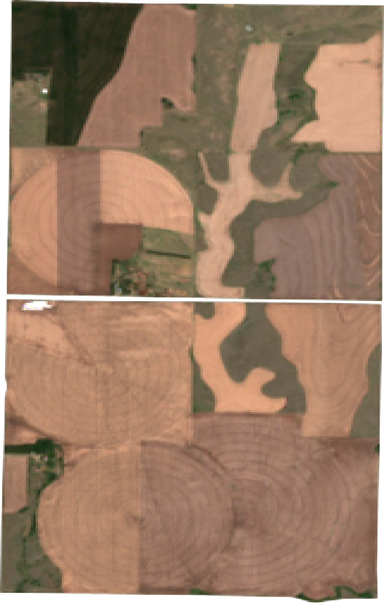
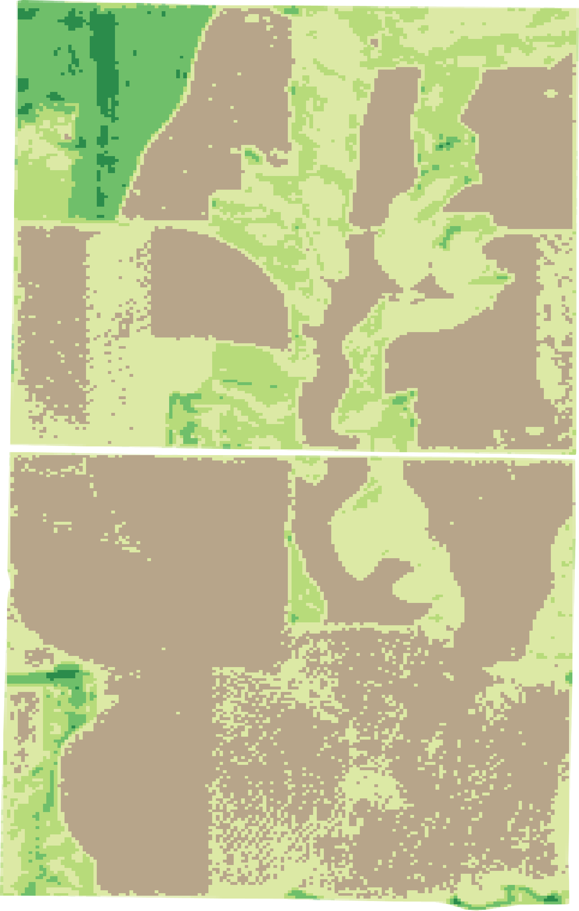
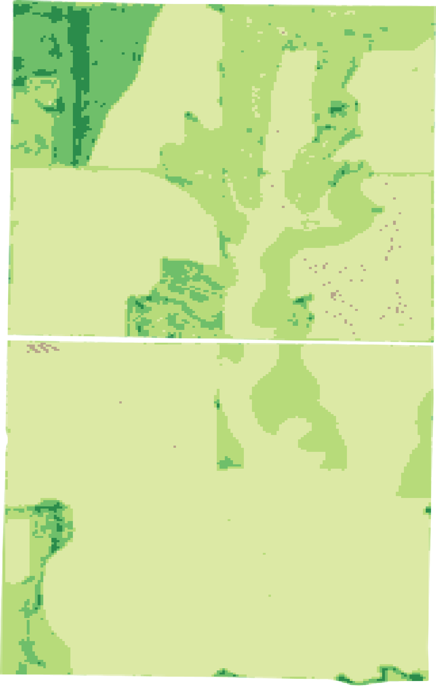
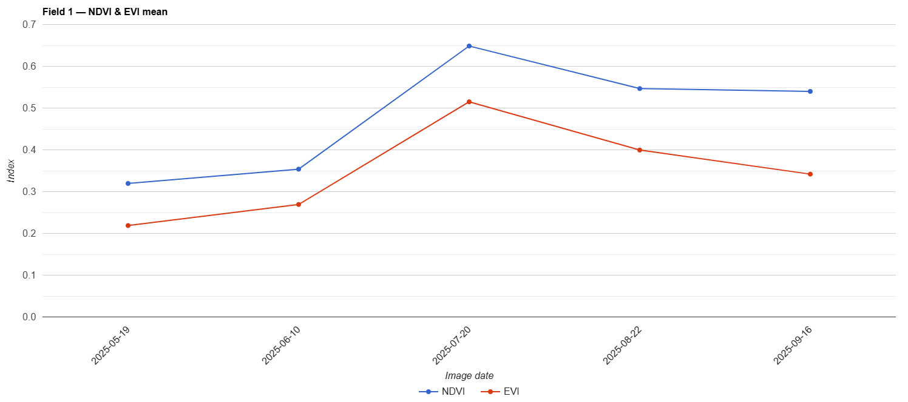
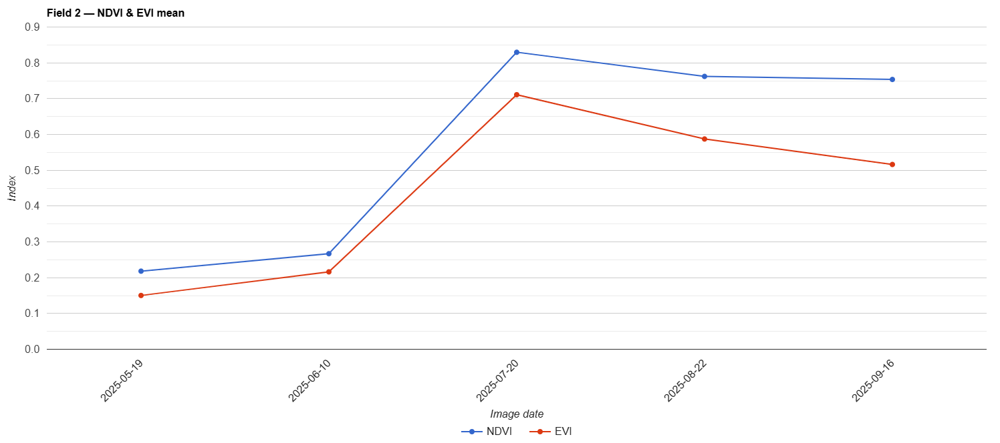

# gee-ndvi-vegetation-monitoring
Automated vegetation monitoring workflow using Sentinel-2, NDVI and EVI in Google Earth Engine
# 🌱 Automated Vegetation Monitoring Workflow (Sentinel-2)

This project demonstrates an **automated vegetation monitoring workflow built in Google Earth Engine**.

The script automatically selects optimal Sentinel-2 scenes around target dates, filters clouds, calculates vegetation indices and generates maps and time-series charts for field polygons.

This workflow can be used for **agriculture monitoring, vegetation health assessment and crop condition analysis.**

---

## 🛰 Data

Satellite imagery: **Sentinel-2 Surface Reflectance (COPERNICUS/S2_SR_HARMONIZED)**
Spatial resolution: **10 meters**

Vegetation indices used:

**NDVI**

NDVI = (NIR − RED) / (NIR + RED)

**EVI**

EVI = 2.5 × (NIR − RED) / (NIR + 6 × RED − 7.5 × BLUE + 1)

---

## 🗺 Example outputs

### RGB satellite image

---

### NDVI vegetation zones

---

### EVI vegetation zones

---

## 📈 Vegetation dynamics

NDVI and EVI time-series charts showing vegetation development during the growing season.

### Field 1

### Field 2

---

## ⚙️ Workflow steps

The script performs the following steps:

• selects Sentinel-2 scenes near target dates
• filters clouds using the SCL band
• calculates **NDVI and EVI**
• classifies vegetation into **5 vegetation zones**
• generates vegetation maps
• calculates mean NDVI and EVI values for each field polygon
• builds time-series charts
• exports RGB, NDVI and EVI maps

---

## 🛠 Technologies

• Google Earth Engine
• Sentinel-2 imagery
• Remote sensing vegetation indices
• JavaScript (Earth Engine API)

---

## 🎥 Video walkthrough

Short explanation of the workflow:

https://youtu.be/djzDnciHuN4

---

## 📬 Contact

I'm currently **open to opportunities in GIS and remote sensing**.

If this type of workflow could be useful for your project, feel free to reach out.

Author:
Ayazhan Karabayeva – GIS / Remote Sensing Analyst
